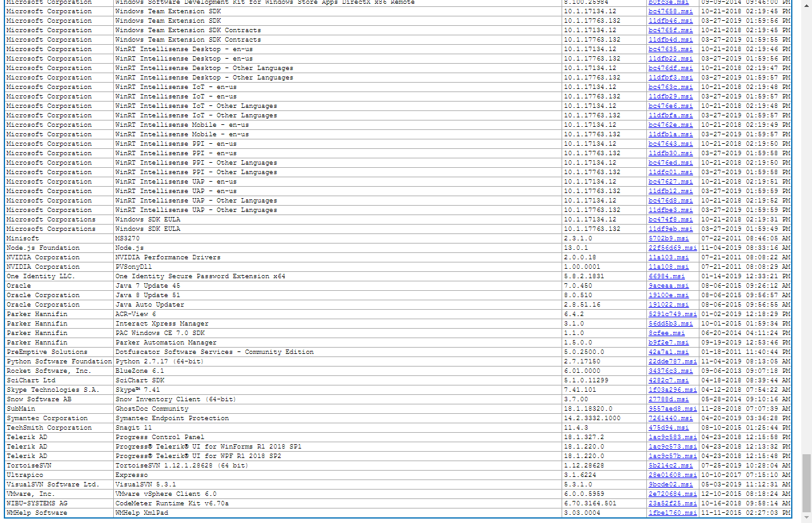
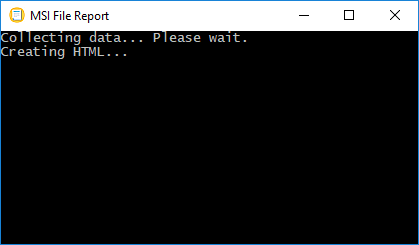

# MsiFileReport
An MS Window's mini-application that when launched creates an html file consisting of 
a single table in html format of data related to all of the MSI files currently 
installed on the local computer.

For example:

While the file is being generated (which can often take a minute or more), a window 
such as the following is displayed in the middle of the screen:

The html file being generated is written to the user's %TEMP% directory, but can be 
saved to a permanent location for viewing later on.

The html file is automatically opened using the default web browser after it has been 
successfully created.

Clicking a hyperlink (shown in blue) inside the table launches the msi file, but only when 
using 'Microsoft Internet Explorer' and only after acknowledging security concerns.